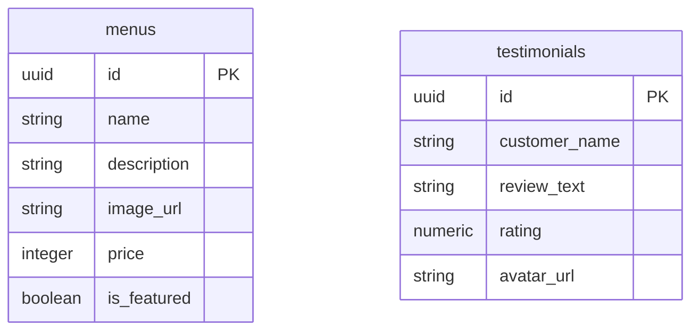

# PRD — Project Requirements Document

## 1. Overview
**Simpang Empat Suki (Depot Simpang 4)** adalah restoran yang menyajikan *Chinese Food* dan *Fresh Seafood* lokal di Balikpapan Baru. Saat ini, dibutuhkan sebuah eksistensi digital yang modern untuk menyelesaikan masalah kurangnya visibilitas online dan mempermudah pelanggan melihat menu serta melakukan pemesanan. 

Tujuan utama dari proyek ini adalah membangun *landing page* (halaman tunggal) yang elegan dan berfokus pada konversi pelanggan tinggi. Aplikasi ini akan menampilkan menu unggulan, informasi operasional, serta ulasan pelanggan, yang pada akhirnya mengarahkan pengunjung untuk langsung melakukan pemesanan melalui Linktree atau WhatsApp.

## 2. Requirements
- **Desain & Tema:** Menggunakan tema *Monochromatic Dark Mode* yang eksklusif. Latar belakang didominasi warna hitam dan abu-abu gelap untuk memaksimalkan ruang negatif. Warna aksen utama (Call-to-Action) menggunakan **Cokelat Muda (Light Brown/Tan)** untuk memberikan kesan hangat, premium, dan natural. Warna putih digunakan secara eksklusif untuk teks utama agar kontras terjaga.
- **Responsivitas:** Pendekatan *Mobile-first*, memastikan tampilan sempurna di layar HP karena sebagian besar pemesanan dilakukan via ponsel, namun tetap menyesuaikan dengan baik di layar desktop.
- **Kesiapan Skalabilitas:** Meskipun saat rilis awal menggunakan data buatan (mock data), arsitektur kode harus disiapkan agar siap dihubungkan dengan database asli (Supabase) di masa depan.
- **Aset & Tracking:** Menggunakan *placeholder* untuk gambar (terutama menu restoran) dan mengintegrasikan Google Analytics untuk melacak perilaku pengunjung.
- **Titik Konversi:** Semua tombol pemesanan akan diarahkan ke satu pintu, yaitu integrasi Linktree dan WhatsApp di nomor telepon `085100612116`.

## 3. Core Features
- **Navigasi Terkunci (Sticky Navbar):** Menu navigasi di bagian atas yang selalu menempel saat di-*scroll*, memuat logo teks sederhana dan tombol aksi pemesanan (CTA) dengan warna aksen Cokelat Muda.
- **Area Utama (Hero Section):** Bagian penyambutan dengan gambar latar belakang berkualitas tinggi (menggunakan *placeholder* yang diredupkan/dark overlay), teks penawaran utama berwarna putih, dan tombol "Pesan Sekarang" yang menonjol dengan latar Cokelat Muda.
- **Informasi Restoran (About Info):** Bagian yang bersih dan mudah dibaca dengan teks putih di atas latar gelap memuat:
  - Alamat: Ruko Sentra Eropa Blok AB 4 No 30-31, Balikpapan Baru.
  - Jam Operasional: 07:00 - 22:00.
- **Etalase Menu Utama (Featured Menu):** Tampilan *grid* elegan berbasis kartu (Card) dengan latar abu-abu gelap/border halus untuk menu andalan (Cap Cay Goreng, Sapo Tahu Seafood, Sapi Lada Hitam, Cumi Telur Asin, Mantau Goreng). Belum memuat gambar asli (menggunakan *placeholder*), tombol/detail harga menggunakan aksen Cokelat Muda.
- **Testimoni Pelanggan:** Menampilkan tiga ulasan pelanggan dengan rating rata-rata 4.8 bintang, lengkap dengan avatar untuk membangun kepercayaan, menggunakan palet warna gelap yang sama.

## 4. User Flow
1. **Kunjungan Awal (Landing):** Pengguna membuka situs dan langsung melihat *Hero Section* dengan gambar makanan yang menarik (nuansa gelap) dan tombol "Pesan Sekarang" berwarna Cokelat Muda.
2. **Eksplorasi Informasi:** Pengguna melakukan *scroll* ke bawah untuk membaca lokasi restoran yang strategis dan jam bukanya dengan teks yang kontras.
3. **Melihat Menu:** Pengguna melihat kartu menu-menu unggulan yang didesain elegan (dark theme) untuk memancing selera.
4. **Validasi Sosial:** Pengguna membaca ulasan positif dari pelanggan sebelumnya di bagian Testimoni.
5. **Konversi (Pemesanan):** Pengguna menekan tombol "Pesan Sekarang" (baik di *Navbar*, *Hero Section*, atau setelah melihat menu) yang berwarna aksen Cokelat Muda.
6. **Langkah Transaksi:** Sistem langsung mengalihkan pengguna ke tautan Linktree atau aplikasi WhatsApp (ke nomor 085100612116) untuk menyelesaikan pesanan langsung dengan staf restoran.

## 5. Architecture
Sistem ini menggunakan arsitektur *frontend* statis/dinamis yang bersifat *client-side* (SPA) dengan fase awal menggunakan *mock data*. Skema disiapkan agar ke depannya *frontend* dapat langsung "menarik" data dari *backend as a service* (Supabase).

```mermaid
graph TD
    Client[Pengguna / Web Browser] --> |Akses Halaman| FrontEnd[Next.js App Router]
    
    subgraph Frontend Application
        FrontEnd --> UI[UI / shadcn Components]
        FrontEnd --> Tracking[Google Analytics]
        
        UI --> DarkMode[Monochromatic Dark Theme (Zinc/Slate/Brown)]
        UI --> Mock[Data Palsu / Mock Data - Fase 1]
        UI -.-> |Fase 2 - Masa Depan| SupabaseSDK[Supabase Client]
    end
    
    SupabaseSDK -.-> |Fetch Menu & Reviews| SupabaseDB[(Supabase PostgreSQL)]
    
    UI --> |Klik Pesan Sekarang| Router[Redirect External]
    Router --> WA[WhatsApp / Linktree]
```

## 6. Database Schema
Walaupun aplikasi fase pertama menggunakan data tiruan (mock data), berikut adalah rancangan skema database untuk disiapkan pada sistem Supabase (PostgreSQL) agar implementasi berikutnya berjalan mulus.

**Daftar Tabel Database:**
1. `menus` (Tabel Menu Makanan)
   - `id` (UUID, Primary Key): Pengenal unik menu.
   - `name` (String): Nama masakan (contoh: Cap Cay Goreng).
   - `description` (String): Deskripsi singkat menu.
   - `image_url` (String): Tautan gambar makanan (placeholder url).
   - `price` (Integer): Harga makanan.
   - `is_featured` (Boolean): Penanda apakah menu ditampilkan di halaman depan.
2. `testimonials` (Tabel Ulasan)
   - `id` (UUID, Primary Key): Pengenal unik ulasan.
   - `customer_name` (String): Nama pelanggan.
   - `review_text` (String): Isi testimoni dari pelanggan.
   - `rating` (Numeric): Skor ulasan (contoh: 4.8).
   - `avatar_url` (String): Tautan gambar profil pelanggan.


*(Catatan: Karena ini adalah landing page sederhana, saat ini tabel berdiri sendiri tanpa relasi kompleks).*

## 7. Tech Stack
Berdasarkan kebutuhan spesifik dari sistem yang diminta, proyek ini HANYA akan menggunakan teknologi berikut:

- **Framework:** Next.js (Versi 14+, menggunakan konfigurasi *App Router*).
- **Styling:** Tailwind CSS (untuk pengaturan tata letak *Dark Mode* eksklusif dan utilitas warna custom seperti Cokelat Muda/Tan).
- **UI Components:** shadcn/ui. Komponen wajib yang di-install adalah `Button`, `Card`, `Avatar`, dan `NavigationMenu`.
- **Ikonografi:** Lucide React (Standar ikon berwarna putih atau abu-abu terang agar sesuai tema).
- **Backend / Database:** Supabase (Arsitektur PostgreSQL untuk kesiapan skala, namun *mock data* dalam bentuk JSON/Array hardcoded digunakan pada versi rilis pertama).
- **Analytics:** Google Analytics (diimplementasikan via skrip pemantauan Next.js pihak ketiga/standar).
- **Penyimpanan Gambar:** Placeholder (*image placeholder service*, belum ada penyimpanan khusus/cloud bucket yang disiapkan saat ini).